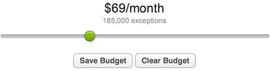
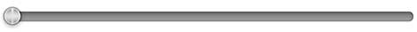

# jQuery Simple Slider: Unobtrusive Numerical Slider

## Overview

Simple Slider is a jQuery plugin which allows your users to select a value
from a numerical range by simply dragging a slider.

## Features

- Configurable without editing any JavaScript
- No external dependencies, apart from jQuery
- Compact size, only 4kb
- Unobtrusive JavaScript, activate using `data-slider="true"` on any input
- Easy to skin/style purely in css, no images required
- Slider value goes directly into your input element, for easy use in normal html forms
- Supports both pre-defined values and a continous ranges
- Supports smooth sliding and snap-to-value sliding
- Supports highlighting the slider background when dragging

## Screenshots



The slider's default style, as used to select a budget on [Bugsnag](https://bugsnag.com).



A slider using the volume style.

## Installation

Include jQuery and the Simple Slider JavaScript and CSS files on your page,
then activate Simple Slider on your text input using the `data-slider` attribute:

```html
<!-- Include jQuery -->
<script src="http://ajax.googleapis.com/ajax/libs/jquery/1.8.2/jquery.min.js"></script>

<!-- Include Simple Slider JavaScript and CSS -->
<script src="yourfiles/simple-slider.js"></script>
<link href="yourfiles/simple-slider.css" rel="stylesheet" type="text/css" />

<!-- Activate Simple Slider on your input -->
<input type="text" data-slider="true">
```

You can also manually turn any text input into a Simple Slider in JavaScript
as follows:

```javascript
$("#my-input").simpleSlider();
```

## Getting Slider Values

The value the user selects with the slider is immediately available inside the
`value` attribute of the text input you attached the slider to. This means you
can include Simple Slider in your HTML forms and the the selected value will
automatically be send to your server when the form is submitted.

If you would like to get the slider's value using javascript, you can register
for the `slider:changed` event:

```javascript
$("#my-input").bind("slider:changed", function (event, data) {
  // The currently selected value of the slider
  alert(data.value);

  // The value as a ratio of the slider (between 0 and 1)
  alert(data.ratio);
});
```

## Configuration

You can configure Simple Slider by either using `data-slider-*` unobtrusive javascript settings, or by passing in a configuration object when initializing the plugin manually.

| Setting | Description | Example |
| ------- | ----------- | ------- |
| `data-slider-range` | The range representing the start and end of the slider. | `data-slider-range="10,1000"` |
| `data-slider-step` | The interval to move when dragging the slider. | `data-slider-step="100"` |
| `data-slider-snap` | Setting this to true makes the slider snap to each step when dragging, otherwise dragging will be continuous. | `data-slider-snap="true"` |
| `data-slider-values` | A pre-defined list of values to allow sliding for. | `data-slider-values="0,100,500,800,2000"` |
| `data-slider-equal-steps` | Setting this to true makes the spacing between each always value equal when used with `data-slider-values`. | `data-slider-equal-steps="true"` |
| `data-slider-theme` | The CSS theme to use when rendering this slider. Setting this value adds a suffix to the CSS class of the slider. | `data-slider-theme="volume"` |
| `data-slider-highlight` | Boolean for if we should highlight the background of the slider as it it dragged. | `data-slider-highlight="true"` |

## Events

You can bind to the following jQuery events using `bind`, for example:

```javascript
$("#my-input").bind("slider:ready", function (event, data) {
  alert("Slider is ready to use");
});
```

| Event | Description |
| ----- | ----------- |
| `slider:ready` | Fired when the slider is loaded and attached to your input field. |
| `slider:changed` | Fired when the value of your slider changes. |

All Simple Slider events pass 2 parameters into your function, `event` and
`data`. `event` is a regular jQuery event object. `data` contains the
following properties:

| Property | Description |
| -------- | ----------- |
| `value` | The current value of the slider. |
| `ratio` | How far, as a percentage, the slider is from start to end (0 - 1). |
| `el` | The generated outer HTML element representing the slider. |

## Methods

| Method | Description |
| ------ | ----------- |
| `selector.simpleSlider("setValue", value)` | Sets the value of the slider. |
| `selector.simpleSlider("setRatio", ratio)` | Sets the ratio (see above) of the slider. |

## Reporting Bugs or Feature Requests

Please report any bugs or feature requests on the github issues page for this
project here:

<https://github.com/loopj/jquery-simple-slider/issues>

## License

Simple Slider is released under the MIT license.
